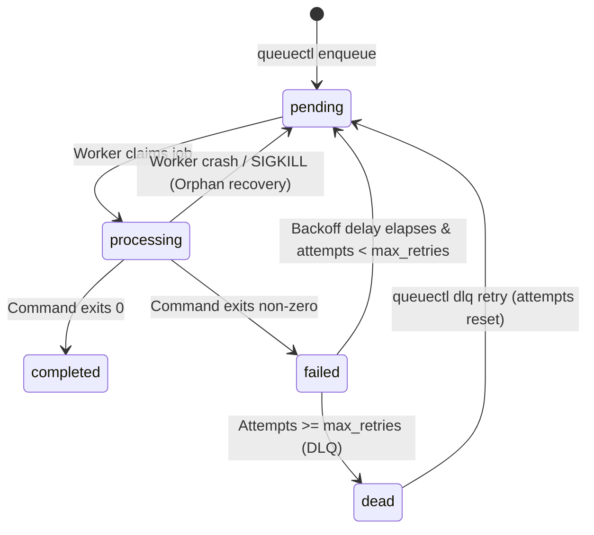

# Data Model: QueueCTL Job Queue

This document specifies the database schemas, tables, and states required to manage background jobs and worker states.

## Database Engine
- **SQLite 3**: Used for storing persistent tables due to native file locking and ACID transactional compliance.

---

## Schema Design

### 1. `jobs` Table
Stores job records, execution metadata, and current state.

| Column | Type | Constraints | Description |
|--------|------|-------------|-------------|
| `id` | TEXT | PRIMARY KEY | Unique job identifier. |
| `command` | TEXT | NOT NULL | Shell command string to be executed. |
| `state` | TEXT | NOT NULL | Current state (see Lifecycle States). |
| `attempts` | INTEGER | DEFAULT 0 | Number of completed execution attempts. |
| `max_retries` | INTEGER | NOT NULL | Maximum retries before moving to DLQ. |
| `worker_id` | TEXT | REFERENCES `workers(id)` | ID of the worker currently processing this job (NULL if idle). |
| `run_at` | TEXT | NOT NULL | ISO 8601 timestamp after which the job is allowed to run (used for backoff scheduling). |
| `created_at` | TEXT | NOT NULL | ISO 8601 creation timestamp. |
| `updated_at` | TEXT | NOT NULL | ISO 8601 last update timestamp. |

---

### 2. `workers` Table
Tracks active worker processes for graceful shutdown and crash recovery.

| Column | Type | Constraints | Description |
|--------|------|-------------|-------------|
| `id` | TEXT | PRIMARY KEY | Unique UUID or PID-based worker identifier. |
| `pid` | INTEGER | NOT NULL | OS process ID of the worker. |
| `last_heartbeat` | TEXT | NOT NULL | ISO 8601 timestamp of the last check-in. |
| `should_stop` | INTEGER | DEFAULT 0 | Flag (0 or 1) signaling the worker to stop gracefully. |

---

### 3. `config` Table
Stores persisted queue configurations.

| Column | Type | Constraints | Description |
|--------|------|-------------|-------------|
| `key` | TEXT | PRIMARY KEY | Configuration parameter name. |
| `value` | TEXT | NOT NULL | Configuration parameter value. |

---

## Job State Transitions

### State Definitions
- **pending**: Ready to be processed by a worker. Scheduled time (`run_at`) must be in the past.
- **processing**: Currently claimed and executing by an active worker.
- **completed**: Execution succeeded (command exited with status code `0`). This is a terminal state.
- **failed**: Execution failed (non-zero exit code). Waiting for its scheduled exponential backoff delay to elapse.
- **dead**: The job has exhausted its retries and is placed in the Dead Letter Queue.
